# Memzent: System Architecture

This document defines the high-level data flow, service boundaries, and networking topology for **Memzent**, an enterprise-grade AI Gateway and Semantic Router.

---

## 1. High-Level Data Flow

The system operates as an **Intelligent Proxy** between user clients, MCP-enabled tools, and Large Language Models (LLMs).

### Execution Sequence:
1. **Ingress**: Gateway receives `POST /v1/chat` with `messages[]` + JWT or API key.
2. **Rate Limiting**: Tier-based token bucket per org/user (`engine.go`) — free 10/min, pro 100/min, business 1000/min.
3. **Billing Pre-Check**: API-key orgs with zero token balance are blocked (JWT dashboard sessions exempt).
4. **Cache L1 + L1.5** (skipped if `X-Skip-Cache: true`; org+model-scoped keys; Postgres fallback):
   - **Layer 1 – Literal**: Exact SHA-256 hash lookup in Valkey (`<5ms`).
   - **Layer 1.5 – Canonical**: Numeric IDs masked (`write011` → `write<ID>`), hash lookup in Valkey.
5. **Session / Memory**: Optional `session_id` history; semantic memory from Qdrant.
6. **RBAC Check**: Postgres `org_tools` permission check (production strict — see `auth/rbac.go`).
7. **Semantic Routing**: gRPC `SelectTools` → Rust Router + Qdrant cosine ≥ 0.88.
8. **Cache L2**: Similar-prompt hash lookup after routing.
9. **Tool Orchestration**: Core, MCP, REST, SQL connectors; optional `PlanToolChain` for multi-step prompts.
10. **Provider Selection**: Ollama / OpenAI / Anthropic / Gemini via header or body `provider`.
11. **LLM Synthesis**: Compressed prompt + tool context + memory → selected LLM.
12. **Cache Population**: Write L1, L1.5, L2 + Postgres persistent cache.

> **Cache + RBAC:** Cache HITs at steps 4 and 8 return before RBAC re-check. Keys are org+model isolated (Option A — documented in `engine.go`).

---

## 2. Infrastructure & Service Topology

| Node / Service | Tech Stack | Role & Responsibility | Internal Port | External Port |
| :--- | :--- | :--- | :--- | :--- |
| **Go Gateway** | Go 1.25 | Orchestration, Auth, RBAC, Caching, Provider Routing | 8080 | `:8080` |
| **Rust Router** | Rust (Tonic) | High-speed Vector Math, Semantic Scoring, Prompt Compression | 50051 | N/A |
| **Command Center** | Next.js 15+ | Dashboard & Audit Log UI | 3000 | `:3000` |
| **MCP Server** | Go | Tool protocol adapter (Phase 1); future: one of many tool connectors | 50052 | N/A |
| **Website** | React 19 / Vite | Public Marketing Page | 5173 | `:5173` |
| **Valkey** | Valkey | Multi-layer in-memory semantic cache | 6379 | N/A |
| **Qdrant** | Qdrant | Vector embedding DB for tool descriptions | 6333 | N/A |
| **Postgres** | PostgreSQL 16 | Users, RBAC rules, audit logs | 5432 | N/A |
| **Ollama** | LLaMA / Meta | Local open-source LLM (default provider) | 11434 | N/A |

---

## 3. Communication Protocols

- **Gateway ⟷ Router**: Strictly typed **Protocol Buffers** (`/proto/router.proto`) over **gRPC**.
- **Gateway ⟷ MCP Server**: **JSON-RPC 2.0** over HTTP via the Model Context Protocol.
- **Client ⟷ Gateway**: Standard **JSON-REST** over HTTP/1.1.
- **Gateway ⟷ Cache**: **Valkey RESP3** via `valkey-go` client (no Redis fallback).

---

## 4. Multi-Provider Routing

Providers are registered at startup. All requests default to **Ollama** unless overridden.

| Header | Body Field | Example Value | Effect |
| :--- | :--- | :--- | :--- |
| `X-Memzent-Provider` | `"provider"` | `"openai"` | Route to OpenAI |
| `X-Memzent-Model` | `"model"` | `"gpt-4o"` | Override default model |
| `X-Skip-Cache` | `"skip_cache"` | `"true"` | Bypass all 3 cache layers |

Headers take lower priority than body fields — JSON body fields win if both are set.

**Registered providers**: `ollama` (always), `openai` (if `OPENAI_API_KEY` set), `anthropic` (if `ANTHROPIC_API_KEY` set), `gemini` (if `GEMINI_API_KEY` set).

---

## 5. Triple-Layer Cache Detail

```
Prompt In
    │
    ├─► [L1] SHA-256(raw prompt) → Valkey GET        <5ms
    │       HIT? Return immediately
    │
    ├─► [L1.5] SHA-256(normalize(prompt)) → Valkey GET   <5ms
    │       normalize(): lowercase + mask \d+ → <ID>
    │       HIT? Back-fill L1 cache, return
    │
    └─► [L2] gRPC SelectTools → Qdrant cosine ≥ 0.88   ~10-30ms
            HIT? Back-fill L1 + L1.5 caches, return
            MISS → LLM Generation → Populate all 3 layers
```

---

## 6. Sequence Diagram

```mermaid
sequenceDiagram
    participant User
    participant Gateway
    participant Valkey
    participant Router
    participant Qdrant
    participant Postgres
    participant MCP
    participant LLM

    User->>Gateway: POST /v1/chat (Prompt + JWT + optional headers)

    rect rgb(30, 30, 30)
    Note over Gateway: Rate Limit Check
    end

    alt X-Skip-Cache != true
        Gateway->>Valkey: L1 Literal Hash Lookup
        Valkey-->>Gateway: HIT → return instantly

        Gateway->>Valkey: L1.5 Canonical Hash Lookup
        Valkey-->>Gateway: HIT → back-fill L1, return
    end

    Gateway->>Postgres: Verify RBAC Permissions
    Postgres-->>Gateway: OK (Allowed Tools)

    Gateway->>Router: gRPC SelectTools(Prompt)
    Router->>Qdrant: Cosine Similarity Search (≥0.88)
    Qdrant-->>Router: Top k Scored Tools
    Router-->>Gateway: Tools + CompressedPrompt + Hashes

    alt L2 Semantic Cache HIT
        Gateway->>Valkey: Lookup by SimilarPromptHash
        Valkey-->>Gateway: HIT → back-fill L1+L1.5, return
    end

    Gateway->>MCP: CallTool(execute_memzent_tool, {tool_id, user_id})
    MCP-->>Gateway: Tool Context (JSON Data)

    Note over Gateway: Select Provider (X-Memzent-Provider / default: ollama)
    Gateway->>LLM: Generate(CompressedPrompt + ToolContext, ModelOverride)
    LLM-->>Gateway: Synthesized Answer

    alt X-Skip-Cache != true
        Gateway->>Valkey: Populate L1 + L1.5 + L2 caches
    end

    Gateway-->>User: Response + X-Cache + X-Memzent-Provider headers
```



---

## 7. Roadmap & Implementation Phases

Memzent is architected as a **Universal AI Gateway** with pluggable tool connectors. The system evolves in phases to support arbitrary AI agents, not just database queries.

### Phase 1: Core Foundation (✅ COMPLETE)
- Triple-layer semantic caching (Literal, Canonical, Semantic)
- RBAC per-user tool filtering via Postgres
- Multi-provider LLM routing (Ollama, OpenAI, Anthropic, Gemini)
- MCP protocol integration + tool execution
- Rust-based semantic routing with Qdrant vector search
- Dashboard REST API integration

### Phase 1.a: Rate Limiting (✅ COMPLETE)
**Goal**: Tier-based rate limits aligned with subscription tier
- [x] Token bucket per org/user in `engine.Process` (free/pro/business)
- [x] PAYG balance boost (free → pro limits when balance > 0)
- [x] Stale limiter eviction (`StartRateLimiterEviction`)
- [ ] Per-tier throttle/backpressure UI in dashboard (future)

### Phase 1.b: Qdrant Optimization (🟡 IN PROGRESS)
**Goal**: Enable Qdrant optimization
- [x] Scalar Quantization (~75% RAM savings)
- [x] `memmap_threshold` for cold data offload to disk
- [x] Payload indexes on `org_id` and `user_id`
- [x] Scheduled local snapshots (`SNAPSHOT_INTERVAL_HOURS` in router)
- [ ] S3 offsite snapshot upload (configure `QDRANT__STORAGE__SNAPSHOTS_CONFIG` in compose)

### Phase 2: Dynamic Tool Registry (✅ COMPLETE)
**Goal**: Tool registration without gateway/MCP restarts
- [x] Postgres `tools` schema + `org_id`, `last_synced_at`, `config`
- [x] `POST /v1/tools/register`, `POST /v1/tools` (list), `POST /v1/tools/sync`
- [x] `GET /v1/tools/status` health timestamp
- [x] 30s refresh loop → Qdrant vectorization via gRPC `RegisterTool`
- [x] Connector type in `/v1/tools` list + live health probes
- [ ] `DELETE /v1/tools/{id}` disable endpoint (not implemented)

### Phase 3: Multi-Connector Framework (🟠 PARTIAL)
**Goal**: Support non-MCP tool types
- [x] Connector abstraction (`internal/connectors/`)
- [x] **Implemented:** Core (native), MCP, REST, SQL
- [ ] **Not implemented:** GraphQL, Webhook, gRPC, ML inference connectors
- [x] Core tools (`read_database`, `memzent_search`) — currently mock responses in `main.go`

### Phase 4: Advanced Orchestration (🟠 PARTIAL)
**Goal**: Enable multi-step AI workflows
- [x] `PlanToolChain` gRPC + sequential execution in engine
- [x] LLM parameter fitting (`fitToolParameters`) from tool JSON Schema
- [x] Model-scoped cache keys (`org:<id>:m:<model>:...`)
- [x] SSE endpoint — **simulated** typewriter (full response generated first, word-split)
- [x] Tool chaining trigger — **keyword heuristic** ("then", "after", "chain") in `engine.go`
- [ ] Provider-native streaming (true token-by-token)
- [ ] Async job queue for long-running tools
- [ ] Error recovery & exponential backoff on tool failures

### Phase 5: BYO LLM Providers
**Goal**: Enable users to bring their own LLM providers
- [ ] Add LLM provider abstraction layer in engine
- [ ] Add LLM provider and its configuration to save with encrypt at rest.
- [ ] Add and Manage LLM provider in Dashboard
- [ ] Make sure End to End flow works with BYO LLM provider
- [ ] Make sure BYO LLM provider works with MCP protocol


---

## 8. Dashboard Integration

**Admin Dashboard** communicates with gateway via REST APIs:

| Endpoint | Method | Purpose |
|---|---|---|
| `/v1/tools` | GET | List available tools + provider metadata + connector type |
| `/v1/stats` | GET | Real-time stats (cache hit %, provider count, uptime, tool count) |
| `/v1/chat` | POST | Execute user prompts + return synthesis |
| `/v1/healthz` | GET | Service health check |
| `/v1/readyz` | GET | Readiness probe (Valkey, Router, Postgres connectivity) |
| `/generate-token` | GET | Issue admin JWT for testing |

---

## 9. Design Principles

1. **Protocol Agnostic**: MCP is current; any tool connector can be swapped in via Phase 3
2. **Semantic-First**: Vector similarity drives tool matching, never keyword search
3. **Cache Optimized**: Triple-layer caching guarantees sub-second response on repeated queries
4. **User Isolated**: RBAC ensures tools execute only within user's permission scope
5. **Provider Flexible**: Clients choose LLM per-request; gateway routes transparently
6. **Extensible by Design**: New tool types added without modifying core engine