# Aura: System Architecture

This document defines the high-level data flow, service boundaries, and networking topology for **Aura**, an enterprise-grade AI Gateway and Semantic Router.

## 1. High-Level Data Flow

The system operates as an **Intelligent Proxy** between varying user clients, MCP-enabled tools, and Large Language Models (LLMs).

### Execution Sequence:
1. **Ingress**: The Go Gateway receives an HTTP request containing a user prompt and authenticates via an RBAC Postgres database.
2. **Semantic Cache Check**: The Gateway checks the Valkey memory store to determine if a semantically identical query has already been resolved to save compute/tokens.
3. **Vector Routing**: If no cache exists, the Gateway delegates the prompt over internal gRPC to the Rust Semantic Router.
4. **Embedding Search**: The Rust Router converts the prompt into a vectorized representation and queries the Qdrant Vector database for the top $k$ most relevant tools.
5. **Tool Orchestration**: The Go Gateway executes the returned tools against the connected Model Context Protocol (MCP) server environment to fetch real-time domain knowledge.
6. **LLM Synthesis**: The original prompt, enriched with the live tool payload data, is dispatched to open-source (Ollama) or closed-source (OpenAI/Anthropic) generators.
7. **Cache Population**: The final synthesized answer is piped to the user and cached in Valkey for future cache-hits.

---

## 2. Infrastructure & Service Topology

| Node / Service | Tech Stack | Role & Responsibility | Internal Port | External Port |
| :--- | :--- | :--- | :--- | :--- |
| **Go Gateway** | Go 1.25 | Orchestration, Auth, RBAC, Core Business Logic | 8080 | `:8080` |
| **Rust Router** | Rust (Tonic) | High-speed Vector Mathematics, Semantic Scoring | 50051 | N/A |
| **Command Center** | Next.js 15+ | "Intelligence Hub" Dashboard & Audit Log UI | 3000 | `:3000` |
| **Website** | React 19 / Vite | Public Marketing Page & SEO Front-End | 5173 | `:5173` |
| **Valkey** | Valkey | High-throughput in-memory semantic cache | 6379 | N/A |
| **Qdrant** | Qdrant | Vector embedding database for tool descriptions | 6333 | N/A |
| **Postgres** | PostgreSQL 16 | Relational database modeling users and RBAC rules | 5432 | N/A |
| **Ollama** | LLaMA / Meta | Private, offline AI generator / Open-source fallback | 11434 | N/A |

---

## 3. Communication Protocols

- **Gateway ⟷ Router**: Strictly typed using **Protocol Buffers** (`/proto/router.proto`) over **gRPC**. This ensures the Go orchestrator and Rust similarity engine stay perfectly in sync despite crossing language boundaries.
- **Gateway ⟷ Tools**: **JSON-RPC 2.0** over HTTP via the standard Model Context Protocol (MCP).
- **Client ⟷ Gateway**: Standard JSON-REST payload over **HTTP/1.1**.

---

## 4. Sequence Diagram

```mermaid
sequenceDiagram
    participant User
    participant Gateway
    participant Valkey
    participant Router
    participant Qdrant
    participant Postgres
    participant MCP
    participant LLM

    User->>Gateway: POST /v1/chat (Prompt + JWT)
    
    rect rgb(30, 30, 30)
    Note over Gateway, Postgres: Security & Rate Limits
    Gateway->>Postgres: Verify RBAC Permissions
    Postgres-->>Gateway: OK (Allowed Tools)
    end
    
    Gateway->>Valkey: GetSemanticResult(Prompt)
    alt Cache HIT
        Valkey-->>Gateway: Cached Response String
        Gateway-->>User: Synthesized Answer (Instant)
    else Cache MISS
        Valkey-->>Gateway: nil
        Gateway->>Router: gRPC: SelectTools(Prompt, AllowedTools)
        Router->>Qdrant: Vector Similarity Search
        Qdrant-->>Router: Top $k$ Scored Tools
        Router-->>Gateway: []Tools
        
        Gateway->>MCP: CallTool(ToolID, Args)
        MCP-->>Gateway: Tool Context (JSON Data)
        
        Gateway->>LLM: Generate(Prompt + Tool Context)
        LLM-->>Gateway: Synthesized Answer
        
        Gateway->>Valkey: SetResult(Prompt, Answer)
        Gateway-->>User: Synthesized Answer
    end
```

