# Aura: System Architecture

This document defines the high-level data flow, service boundaries, and networking topology for **Aura**, an enterprise-grade AI Gateway and Semantic Router.

---

## 1. High-Level Data Flow

The system operates as an **Intelligent Proxy** between user clients, MCP-enabled tools, and Large Language Models (LLMs).

### Execution Sequence:
1. **Ingress**: The Go Gateway receives an HTTP request containing a user prompt + JWT token.
2. **Rate Limiting**: Token bucket per user — 10 requests/minute max.
3. **Triple-Layer Cache Check** (skipped if `X-Skip-Cache: true`):
   - **Layer 1 – Literal**: Exact SHA-256 hash lookup in Valkey (`<5ms`).
   - **Layer 1.5 – Canonical**: Numeric IDs masked (`write011` → `write<ID>`), hash lookup in Valkey. Catches logically identical queries with minor numeric variations.
   - **Layer 2 – Semantic (Vector)**: Gateway calls Rust Router via gRPC; Router performs cosine similarity search in Qdrant at ≥ 0.88 threshold.
4. **RBAC Check**: Postgres query for user permissions and allowed tool list.
5. **Semantic Routing**: gRPC call to the Rust Router returns the best-matched tools + compressed prompt.
6. **Tool Orchestration** *(Extensible Platform)*: Gateway executes matched tools. *Current: MCP protocol. Future: Dynamic tool registry with REST/GraphQL/SQL/webhook connectors (to be implemented)*.
7. **Provider Selection**: Gateway routes to Ollama / OpenAI / Anthropic / Gemini based on `X-Aura-Provider` header or `provider` field in request body.
8. **LLM Synthesis**: The compressed prompt + tool context is dispatched to the selected LLM.
9. **Cache Population**: Synthesized answer is stored in all three cache layers (Literal, Canonical, Semantic).

---

## 2. Infrastructure & Service Topology

| Node / Service | Tech Stack | Role & Responsibility | Internal Port | External Port |
| :--- | :--- | :--- | :--- | :--- |
| **Go Gateway** | Go 1.25 | Orchestration, Auth, RBAC, Caching, Provider Routing | 8080 | `:8080` |
| **Rust Router** | Rust (Tonic) | High-speed Vector Math, Semantic Scoring, Prompt Compression | 50051 | N/A |
| **Command Center** | Next.js 15+ | Dashboard & Audit Log UI | 3000 | `:3000` |
| **MCP Server** | Go | Tool protocol adapter (Phase 1); future: one of many tool connectors | 50052 | N/A |
| **Website** | React 19 / Vite | Public Marketing Page | 5173 | `:5173` |
| **Valkey** | Valkey | Multi-layer in-memory semantic cache | 6379 | N/A |
| **Qdrant** | Qdrant | Vector embedding DB for tool descriptions | 6333 | N/A |
| **Postgres** | PostgreSQL 16 | Users, RBAC rules, audit logs | 5432 | N/A |
| **Ollama** | LLaMA / Meta | Local open-source LLM (default provider) | 11434 | N/A |

---

## 3. Communication Protocols

- **Gateway ⟷ Router**: Strictly typed **Protocol Buffers** (`/proto/router.proto`) over **gRPC**.
- **Gateway ⟷ MCP Server**: **JSON-RPC 2.0** over HTTP via the Model Context Protocol.
- **Client ⟷ Gateway**: Standard **JSON-REST** over HTTP/1.1.
- **Gateway ⟷ Cache**: **Valkey RESP3** via `valkey-go` client (no Redis fallback).

---

## 4. Multi-Provider Routing

Providers are registered at startup. All requests default to **Ollama** unless overridden.

| Header | Body Field | Example Value | Effect |
| :--- | :--- | :--- | :--- |
| `X-Aura-Provider` | `"provider"` | `"openai"` | Route to OpenAI |
| `X-Aura-Model` | `"model"` | `"gpt-4o"` | Override default model |
| `X-Skip-Cache` | `"skip_cache"` | `"true"` | Bypass all 3 cache layers |

Headers take lower priority than body fields — JSON body fields win if both are set.

**Registered providers**: `ollama` (always), `openai` (if `OPENAI_API_KEY` set), `anthropic` (if `ANTHROPIC_API_KEY` set), `gemini` (if `GEMINI_API_KEY` set).

---

## 5. Triple-Layer Cache Detail

```
Prompt In
    │
    ├─► [L1] SHA-256(raw prompt) → Valkey GET        <5ms
    │       HIT? Return immediately
    │
    ├─► [L1.5] SHA-256(normalize(prompt)) → Valkey GET   <5ms
    │       normalize(): lowercase + mask \d+ → <ID>
    │       HIT? Back-fill L1 cache, return
    │
    └─► [L2] gRPC SelectTools → Qdrant cosine ≥ 0.88   ~10-30ms
            HIT? Back-fill L1 + L1.5 caches, return
            MISS → LLM Generation → Populate all 3 layers
```

---

## 6. Sequence Diagram

```mermaid
sequenceDiagram
    participant User
    participant Gateway
    participant Valkey
    participant Router
    participant Qdrant
    participant Postgres
    participant MCP
    participant LLM

    User->>Gateway: POST /v1/chat (Prompt + JWT + optional headers)

    rect rgb(30, 30, 30)
    Note over Gateway: Rate Limit Check
    end

    alt X-Skip-Cache != true
        Gateway->>Valkey: L1 Literal Hash Lookup
        Valkey-->>Gateway: HIT → return instantly

        Gateway->>Valkey: L1.5 Canonical Hash Lookup
        Valkey-->>Gateway: HIT → back-fill L1, return
    end

    Gateway->>Postgres: Verify RBAC Permissions
    Postgres-->>Gateway: OK (Allowed Tools)

    Gateway->>Router: gRPC SelectTools(Prompt)
    Router->>Qdrant: Cosine Similarity Search (≥0.88)
    Qdrant-->>Router: Top k Scored Tools
    Router-->>Gateway: Tools + CompressedPrompt + Hashes

    alt L2 Semantic Cache HIT
        Gateway->>Valkey: Lookup by SimilarPromptHash
        Valkey-->>Gateway: HIT → back-fill L1+L1.5, return
    end

    Gateway->>MCP: CallTool(execute_aura_tool, {tool_id, user_id})
    MCP-->>Gateway: Tool Context (JSON Data)

    Note over Gateway: Select Provider (X-Aura-Provider / default: ollama)
    Gateway->>LLM: Generate(CompressedPrompt + ToolContext, ModelOverride)
    LLM-->>Gateway: Synthesized Answer

    alt X-Skip-Cache != true
        Gateway->>Valkey: Populate L1 + L1.5 + L2 caches
    end

    Gateway-->>User: Response + X-Cache + X-Aura-Provider headers
```



---

## 7. Roadmap & Implementation Phases

Aura is architected as a **Universal AI Gateway** with pluggable tool connectors. The system evolves in phases to support arbitrary AI agents, not just database queries.

### Phase 1: Core Foundation (✅ COMPLETE)
- Triple-layer semantic caching (Literal, Canonical, Semantic)
- RBAC per-user tool filtering via Postgres
- Multi-provider LLM routing (Ollama, OpenAI, Anthropic, Gemini)
- MCP protocol integration + tool execution
- Rust-based semantic routing with Qdrant vector search
- Dashboard REST API integration

### Phase 2: Dynamic Tool Registry (🚀 IN PROGRESS)
**Goal**: Enable tool registration without gateway/MCP restarts
- [ ] Create Postgres schema: `tools` table with metadata + connection details
- [ ] Implement `POST /v1/tools/register` endpoint (admin-only)
- [ ] Implement `DELETE /v1/tools/{toolId}` endpoint (disable tool)
- [ ] Load tools from Postgres at startup + periodically refresh
- [ ] Embed tool metadata in Qdrant for semantic matching
- [ ] Return tool connector type in `/v1/tools` list

### Phase 3: Multi-Connector Framework (📋 PLANNED Q2)
**Goal**: Support non-MCP tool types
- [ ] Add tool connector abstraction layer in engine
- [ ] REST API connector (HTTP GET/POST with schema validation)
- [ ] GraphQL connector (query execution + response mapping)
- [ ] SQL connector (direct DB query routing with RBAC)
- [ ] gRPC connector (service call marshaling)
- [ ] Webhook connector (async callbacks with job queue)
- [ ] ML inference connector (model API calls: Hugging Face, Replicate, etc.)

### Phase 4: Advanced Orchestration (📋 PLANNED Q3)
**Goal**: Enable multi-step AI workflows
- [ ] Tool chaining (output of tool N → input of tool N+1)
- [ ] Async job queue (Bull/RabbitMQ) for long-running tools
- [ ] Result streaming (SSE/WebSocket for live progress)
- [ ] Tool composition (input/output schema matching)
- [ ] Error recovery & retry logic

### Phase 4: Advanced Orchestration (📋 PLANNED Q3)
**Goal**: Enable multi-step AI workflows
- [ ] Tool chaining (output of tool N → input of tool N+1)
- [ ] Async job queue (Bull/RabbitMQ) for long-running tools
- [ ] Result streaming (SSE/WebSocket for live progress)
- [ ] Tool composition (input/output schema matching)
- [ ] Error recovery & retry logic

### Phase 5: BYO LLM Providers
**Goal**: Enable users to bring their own LLM providers
- [ ] Add LLM provider abstraction layer in engine
- [ ] Add LLM provider and its configuration to save with encrypt at rest.
- [ ] Add and Manage LLM provider in Dashboard
- [ ] Make sure End to End flow works with BYO LLM provider
- [ ] Make sure BYO LLM provider works with MCP protocol


---

## 8. Dashboard Integration

**Admin Dashboard** communicates with gateway via REST APIs:

| Endpoint | Method | Purpose |
|---|---|---|
| `/v1/tools` | GET | List available tools + provider metadata + connector type |
| `/v1/stats` | GET | Real-time stats (cache hit %, provider count, uptime, tool count) |
| `/v1/chat` | POST | Execute user prompts + return synthesis |
| `/v1/healthz` | GET | Service health check |
| `/v1/readyz` | GET | Readiness probe (Valkey, Router, Postgres connectivity) |
| `/generate-token` | GET | Issue admin JWT for testing |

---

## 9. Design Principles

1. **Protocol Agnostic**: MCP is current; any tool connector can be swapped in via Phase 3
2. **Semantic-First**: Vector similarity drives tool matching, never keyword search
3. **Cache Optimized**: Triple-layer caching guarantees sub-second response on repeated queries
4. **User Isolated**: RBAC ensures tools execute only within user's permission scope
5. **Provider Flexible**: Clients choose LLM per-request; gateway routes transparently
6. **Extensible by Design**: New tool types added without modifying core engine