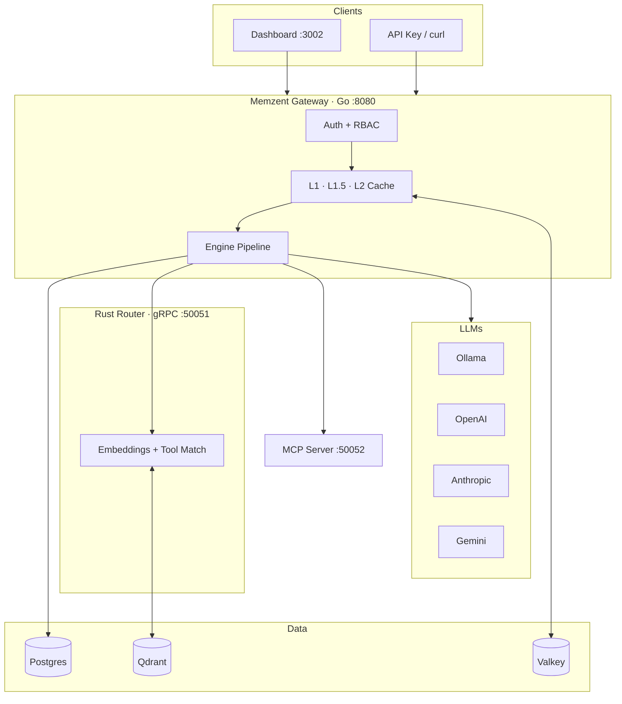
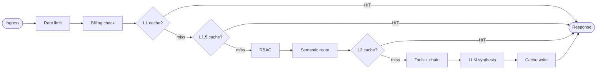
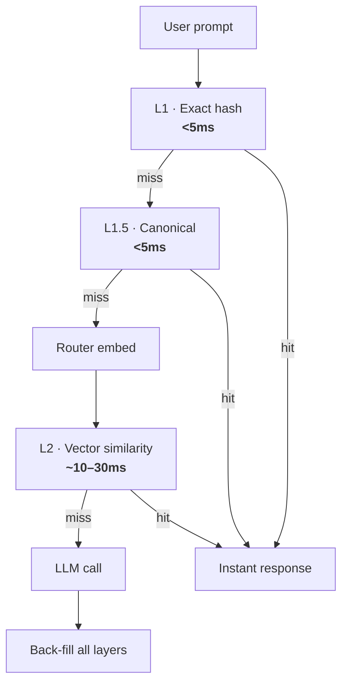

<div align="center">

# Memzent

### The memory & security layer for agentic AI

**Intelligent Semantic Proxy** — cache, route, and govern every LLM call before it costs you.

<br />

[](./services/gateway)
[](./services/router)
[](./services/dashboard)
[](./docker-compose.yml)

<br />

[memzent.ai](https://memzent.ai) · [Architecture](./ARCHITECTURE.md) · [Status](./PROJECT_STATUS.md) · [Go-Live](./GO_LIVE_CHECKLIST.md) · [Agents](./AGENTS.md)

</div>

---

## At a glance

<table>
<tr>
<td width="50%" valign="top">

### 🧠 Remember
Triple-layer cache — **L1** exact · **L1.5** canonical · **L2** semantic vector

</td>
<td width="50%" valign="top">

### 🛡️ Protect
JWT + API keys · org RBAC · tiered rate limits · token billing

</td>
</tr>
<tr>
<td valign="top">

### 🎯 Route
Rust router matches tools via Qdrant **before** the LLM runs

</td>
<td valign="top">

### ⚡ Optimize
Multi-provider routing · prompt compression · optional tool chains

</td>
</tr>
</table>

> **One line:** Answer from cache when you can. Call the LLM only when you must.

---

## Contents

| | |
|---|---|
| [System topology](#-system-topology) | How services connect |
| [Request pipeline](#-request-pipeline) | What happens on `POST /v1/chat` |
| [Cache layers](#-cache-layers) | L1 → L1.5 → L2 explained |
| [Tech stack](#-tech-stack) | Services, ports, protocols |
| [Quick start](#-quick-start) | Local setup in 4 steps |
| [API](#-api) | Request / response contract |
| [Development](#-development) | Tests & load tools |
| [Status](#-status) | What's ready vs pending |

---

## 🏗 System topology



<details>
<summary><strong>ASCII version</strong> (plain-text fallback)</summary>

```
  Dashboard · API Key · curl
              │
              ▼
  ┌─────────────────────────────────────┐
  │         GATEWAY  :8080              │
  │  Auth → RBAC → Cache → Tools → LLM  │
  └───────┬─────────────┬───────────────┘
          │             │
     Valkey │        Rust Router ── Qdrant
     Postgres          │
          │        Ollama · OpenAI · Anthropic · Gemini
          └──────── MCP :50052
```

</details>

---

## 🔄 Request pipeline

Every `POST /v1/chat` follows the same path:



| Step | What | Where |
|:--:|------|-------|
| 1 | Rate limit (tier bucket) | `engine.go` |
| 2 | Billing pre-check (API keys) | `engine.go` |
| 3–4 | Cache L1 + L1.5 | Valkey + Postgres fallback |
| 5 | Session + semantic memory | Postgres + Qdrant |
| 6 | RBAC `chat:execute` | Postgres `org_tools` |
| 7 | Tool match + compression | Rust gRPC |
| 8 | Cache L2 (similar prompt) | Valkey |
| 9–10 | Tool exec + LLM | Connectors + providers |
| 11 | Cache populate + audit | Valkey + Postgres |

→ Deep dive: [ARCHITECTURE.md](./ARCHITECTURE.md)

---

## 💾 Cache layers

Three chances to skip the LLM — each layer is faster than the last.



| Layer | Match | Latency | Mechanism |
|:-----:|-------|:-------:|-----------|
| **L1** | Exact prompt | <5ms | SHA-256 → Valkey |
| **L1.5** | Normalized form | <5ms | Mask IDs / noise → hash |
| **L2** | Semantic similarity | 10–30ms | Qdrant cosine ≥ 0.88 |

Keys are **org + model scoped**. Postgres backs Valkey if cache restarts.

---

## 🧰 Tech stack

<table>
<thead>
<tr>
<th>Layer</th>
<th>Service</th>
<th>Stack</th>
<th>Port</th>
</tr>
</thead>
<tbody>
<tr>
<td align="center">🚪</td>
<td><b>Gateway</b></td>
<td>Go 1.25</td>
<td><code>8080</code></td>
</tr>
<tr>
<td align="center">🧠</td>
<td><b>Router</b></td>
<td>Rust · Tonic · FastEmbed</td>
<td><code>50051</code></td>
</tr>
<tr>
<td align="center">🎛️</td>
<td><b>Dashboard</b></td>
<td>Next.js 15 · React 19</td>
<td><code>3002</code></td>
</tr>
<tr>
<td align="center">🔧</td>
<td><b>MCP Server</b></td>
<td>Go · MCP</td>
<td><code>50052</code></td>
</tr>
<tr>
<td align="center">⚡</td>
<td><b>Cache</b></td>
<td>Valkey 8</td>
<td><code>6379</code></td>
</tr>
<tr>
<td align="center">📐</td>
<td><b>Vectors</b></td>
<td>Qdrant</td>
<td><code>6333</code></td>
</tr>
<tr>
<td align="center">🗄️</td>
<td><b>Database</b></td>
<td>Postgres / Supabase</td>
<td><code>5432</code></td>
</tr>
</tbody>
</table>

**Protocols:** REST · gRPC/Protobuf · MCP JSON-RPC · Valkey RESP3

| Boundary | Rule |
|----------|------|
| Go ↔ Rust | gRPC only — [`proto/router.proto`](./proto/router.proto) |
| Go ↔ Tools | MCP |
| Go ↔ Cache | `valkey-go` — no vector math in Go |

---

## 🚀 Quick start

<table>
<tr>
<td><b>1</b></td>
<td>

**Configure**

```powershell
cp .env.example .env
# POSTGRES_URL · JWKS_URL · provider keys
```

</td>
</tr>
<tr>
<td><b>2</b></td>
<td>

**Launch**

```powershell
docker compose up -d --build
```

</td>
</tr>
<tr>
<td><b>3</b></td>
<td>

**Verify**

| Service | URL |
|---------|-----|
| Health | http://localhost:8080/healthz |
| Chat | http://localhost:8080/v1/chat |
| Dashboard | http://localhost:3002 |
| Metrics | http://localhost:8080/metrics |

</td>
</tr>
<tr>
<td><b>4</b></td>
<td>

**First prompt**

```powershell
cd services/gateway
$token = (go run ./scripts/maketoken 2>$null) -replace '^Bearer ',''
curl.exe -X POST http://localhost:8080/v1/chat `
  -H "Authorization: Bearer $token" `
  -H "Content-Type: application/json" `
  -d '{"messages":[{"role":"user","content":"Hello Memzent"}]}'
```

</td>
</tr>
</table>

> ⚠️ **Production:** `ENVIRONMENT=production` · strong `JWT_SECRET` · `CORS_ALLOWED_ORIGINS`  
> 📦 **Migrations:** [apply-pending-migrations.md](./scripts/apply-pending-migrations.md) (020 + 021)

**Prerequisites:** Docker · [Ollama](https://ollama.com) (`llama3.2`) · Postgres

---

## 📡 API

<details open>
<summary><b>POST /v1/chat</b> — primary endpoint</summary>

<br />

**Auth:** `Authorization: Bearer <jwt>` **or** `X-API-Key: memzent_...`

| Header | Effect |
|--------|--------|
| `X-Memzent-Provider` | `ollama` · `openai` · `anthropic` · `gemini` |
| `X-Memzent-Model` | Model override |
| `X-Skip-Cache` | Bypass all cache layers |
| `Accept: text/event-stream` | SSE (native on Ollama) |

**Request**

```json
{
  "messages": [{ "role": "user", "content": "Your prompt here" }],
  "session_id": "optional-uuid",
  "provider": "openai",
  "model": "gpt-4o",
  "chain": false,
  "stream": false
}
```

**Response**

```json
{
  "text": "...",
  "cached": false,
  "provider": "OpenAI",
  "request_id": "a1b2c3..."
}
```

**Headers back:** `X-Cache: HIT` · `X-Memzent-Provider` · `X-Request-ID`

</details>

<details>
<summary><b>Other routes</b></summary>

<br />

| Route | Purpose |
|-------|---------|
| `GET /v1/tools` | List org tools |
| `POST /v1/tools` | Register tool |
| `GET /v1/keys` | API key management |
| `POST /v1/billing/checkout` | Stripe top-up |
| `GET /v1/analytics/context` | Token & cache analytics |
| `GET /metrics` | Prometheus |
| `GET /healthz` · `GET /readyz` | Probes |

</details>

---

## 🛠 Development

<details>
<summary><b>Run tests</b></summary>

```powershell
# Gateway unit tests
cd services/gateway && go test ./... -count=1

# Integration (Valkey)
docker compose -f docker-compose.test.yml up -d valkey
$env:VALKEY_ADDR="localhost:6379"
go test -tags=integration ./tests/integration/... -count=1

# Router
cd services/router && cargo test

# Dashboard
cd services/dashboard && bun run test
```

</details>

<details>
<summary><b>Load test</b> (env vars only)</summary>

```powershell
cd services/gateway
$env:JWT_SECRET="..."; $env:MEMZENT_ORG_ID="..."; $env:MEMZENT_API_KEY="..."
go run scripts/test_flow.go
```

</details>

<details>
<summary><b>Repository map</b></summary>

```
Memzent.AI/
├── services/gateway/     # Go orchestrator · internal/engine/
├── services/router/      # Rust vectors · Qdrant
├── services/dashboard/   # Next.js control tower
├── services/mcp-server/  # MCP tool host
├── proto/router.proto    # gRPC contract
├── migrations/           # Postgres schema
├── docker-compose.yml
└── docker-compose.test.yml
```

</details>

---

## 📊 Status

| Area | | Notes |
|------|:-:|-------|
| Triple-layer cache + engine | ✅ | L1 · L1.5 · L2 + Postgres fallback |
| Multi-provider LLM routing | ✅ | Ollama · OpenAI · Anthropic · Gemini |
| Semantic tool routing + chains | ✅ | `chain: true` or confidence ≥ 0.65 |
| RBAC + API key rotation | 🟡 | Code done — apply migrations **020/021** |
| SSE streaming | 🟡 | Native Ollama; chunked fallback elsewhere |
| CI (Go · Rust · Dashboard) | ✅ | GitHub Actions |
| Production observability | ⬜ | [observability checklist](./scripts/observability-checklist.md) |

**Demo-ready** — core engine works E2E. Go-live tasks: [GO_LIVE_CHECKLIST.md](./GO_LIVE_CHECKLIST.md) · Full matrix: [PROJECT_STATUS.md](./PROJECT_STATUS.md)

---

## Principles

| # | Principle |
|:-:|-----------|
| 1 | **Cache before compute** — every avoided LLM call is ROI |
| 2 | **Strict boundaries** — Go orchestrates, Rust vectors, Next.js UI |
| 3 | **Org isolation** — cache keys, RBAC, audit scoped per tenant |
| 4 | **Honest docs** — demo stubs and heuristics are labeled |

---

<div align="center">

<br />

**Memzent** — turn stateless LLM calls into secure, context-aware agent systems.

<br />

<sub>Built by the Memzent Engineering Team</sub>

</div>
