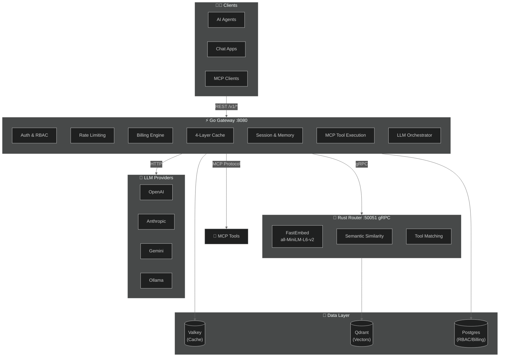
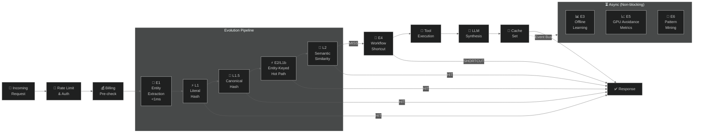
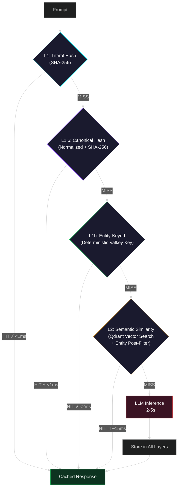
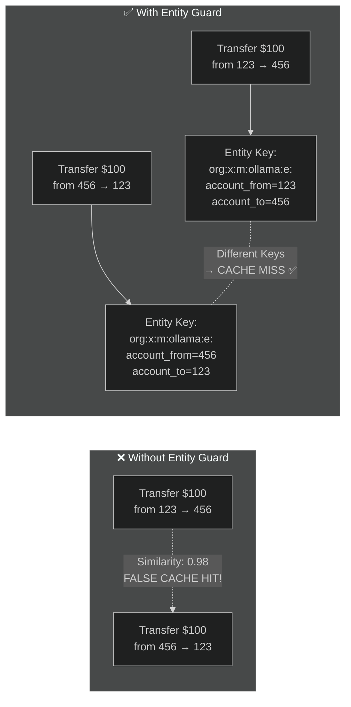
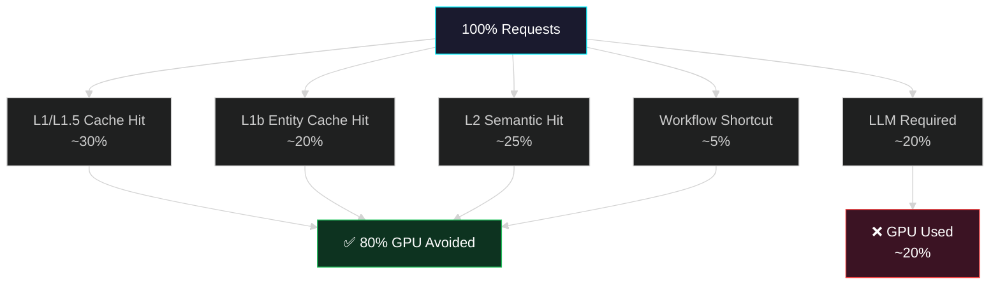

# Memzent Architecture Diagrams

> Render these with [mermaid.live](https://mermaid.live), VS Code Mermaid extension, or any Mermaid-compatible tool. Export as PNG/SVG for LinkedIn, blog posts, etc.

---

## 1. High-Level System Architecture



---

## 2. Evolution Pipeline (E1–E6) — Request Flow



---

## 3. Four-Layer Cache Architecture



---

## 4. Entity Extraction Guard (Why Similarity Alone Fails)



---

## 5. Deployment Architecture (Docker Compose)

```mermaid
%%{init: {'theme': 'dark'}}%%

graph TB
    subgraph Docker["Docker Network: memzent-net"]
        GW["gateway:8080\n(Go 1.25)"]
        RT["router:50051\n(Rust/Tonic)"]
        VK["valkey:6379\n(Cache)"]
        QD["qdrant:6333/6334\n(Vectors)"]
        PG["Supabase Postgres\n(External)"]
        DB["dashboard:3000\n(Next.js 16)"]
        WS["website:5173\n(Vite + React)"]
    end

    Users["Users"] --> DB
    Users --> WS
    DB -->|"REST /v1/*"| GW
    GW -->|"gRPC :50051"| RT
    GW --> VK
    RT --> QD
    GW --> PG

    style GW fill:#1a4a3a,stroke:#22c55e
    style RT fill:#1a2a4a,stroke:#3b82f6
    style VK fill:#4a1a1a,stroke:#ef4444
    style QD fill:#4a3a1a,stroke:#f59e0b
    style DB fill:#1a1a4a,stroke:#7c3aed
    style WS fill:#1a1a4a,stroke:#7c3aed
```



---

## 6. GPU Avoidance Funnel



---

## Usage

### Render to PNG (for LinkedIn)
1. Go to [mermaid.live](https://mermaid.live)
2. Paste any diagram above
3. Click "Actions" → Download PNG
4. **LinkedIn recommended**: 1200×628px

### Render locally with CLI
```bash
# Install mermaid-cli
npm install -g @mermaid-js/mermaid-cli

# Render a specific diagram (extract the mermaid block first)
mmdc -i diagram.mmd -o architecture.png -t dark -w 1200 -H 628 -b '#0a0a1a'
```

### Best diagram for each context

| Context | Recommended Diagram |
|---------|-------------------|
| **LinkedIn intro post** | #1 High-Level Architecture |
| **Technical blog** | #2 Evolution Pipeline |
| **Explaining the cache** | #3 Four-Layer Cache |
| **Why entity extraction?** | #4 Entity Guard |
| **Self-hosting docs** | #5 Deployment |
| **Business value pitch** | #6 GPU Avoidance Funnel |
